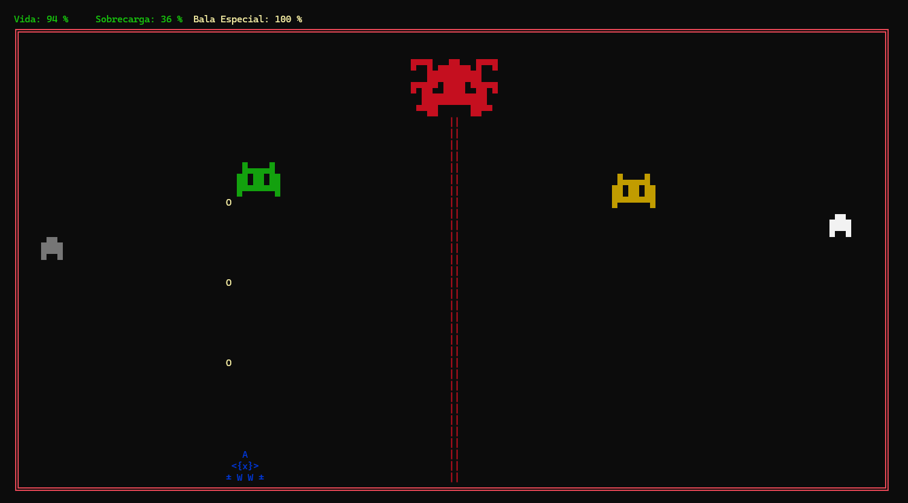

# 🚀 Space Battle Console

Juego de consola hecho en C# donde manejás una nave espacial y enfrentás oleadas de enemigos en combates retro estilo ASCII. ¡Usá tus habilidades, esquivá disparos y destruí al jefe final!



---

## 🎮 Cómo jugar

- **Mover nave:** Flechas ← ↑ ↓ →
- **Disparar:**
  - `Z`: Disparo normal izquierdo
  - `C`: Disparo normal derecho
  - `X`: Bala especial (requiere carga al 100%)

### 📊 Indicadores en pantalla

- `Vida`: Salud restante de la nave
- `Sobrecarga`: Aumenta al disparar, puede impedir disparos si llega al 100%
- `Bala Especial`: Carga necesaria para usar la súper bala (`X`)

---

## 🧠 Objetivo del juego

El juego consiste en sobrevivir y eliminar 3 oleadas de enemigos:

1. **Oleada 1:** 2 enemigos normales
2. **Oleada 2:** 2 enemigos normales + 2 minibosses
3. **Oleada Final:** 2 enemigos normales + 2 minibosses + 1 jefe final

Al derrotar al jefe, ¡ganás la partida!

---

## ⚙️ Instalación y ejecución

1. Clonar el repositorio:
   ```bash
   git clone https://github.com/GraSo211/game_spaceship.git
   cd space-battle-console
